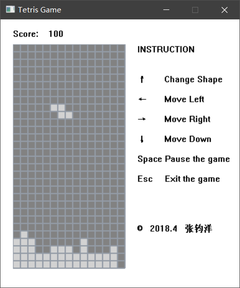

# tetris-game

> Tetris WinAPI Win32 C/C++

Win32程序，主要代码在`TetrisGame_zjy.cpp`和`shapes.h`中。

## 形状存储

使用二维数组存储七种形状，遍历填充，通过矩阵的旋转算法进行变换。

```
static int shapes[7][4][4] = {
  {
      { 0, 0, 0, 0 },
      ( 0, 1, 0, 0 },
      { 1, 1, 1, 0 },
      { 0, 0, 0, 0 },
  },
  
  ......

}

```

## demo展示


